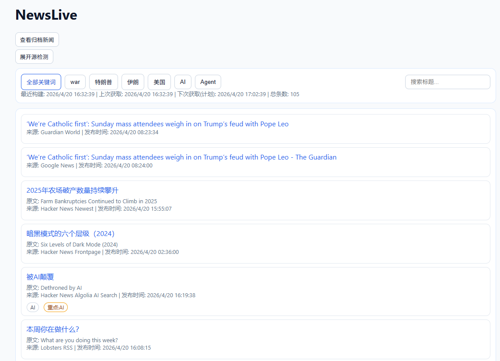

# NewsLive

## 项目简介

NewsLive 是一个新闻聚合与筛选工具，支持本地网页运行和 GitHub Pages 静态发布。  
核心目标是：按配置抓取多源新闻、进行关键词匹配、可选 AI 翻译、重点内容推送，并保留当天新闻与归档能力。

## 主要功能

- 多源抓取（`html_links` / `browser_html_links` / `rss` / `json_items` / `markdown_link_pages`）
- 普通关键词筛选 + 重点关键词推送
- AI 标题翻译（Anthropic 接口兼容）
- 仅保留当日新闻
- 同日去重处理
- 推送支持（day.app / ntfy）
- 源健康检查面板
- 归档功能（按配置定期清理并可归档）

## 技术栈
- Node.js（ESM）：后端运行环境
- Express：本地 Web 服务与 API（状态、刷新、归档接口）
- Cheerio：HTML/XML 解析（网页和 RSS 抓取）
- Playwright：动态页面渲染抓取（browser_html_links）
- YAML：配置驱动（setting.yaml / sources.yaml / keywords.yaml）
- dotenv：读取 .env 环境变量
- 原生 Fetch/Undici 生态：网络请求与代理测试脚本
- 纯前端原生 JS + HTML/CSS：本地页面与静态页面 UI
- GitHub Actions + GitHub Pages：定时任务、构建与静态部署

## 项目截图
